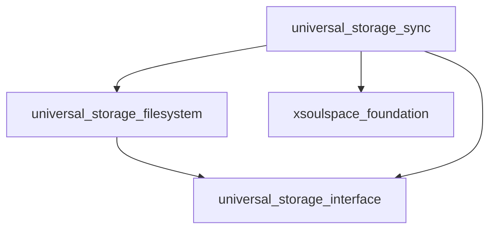

# Dependency Graph Analyzer

Visualize and validate inter-package dependencies in the Dart/Flutter monorepo.

## Quick Start

When analyzing dependencies:

1. Scan all pubspec.yaml files
2. Build dependency graph
3. Detect issues (circular deps, version conflicts)
4. Determine update order

## Analysis Workflow

### Step 1: Scan Package Dependencies

Find all packages and their dependencies:

```bash
# List all packages
find pkgs -name "pubspec.yaml" -not -path "*/example/*" | sort

# Extract dependencies from a package
grep -A 20 "^dependencies:" pkgs/<package>/pubspec.yaml
```

### Step 2: Build Dependency Map

Create a map of package relationships:

**Local dependencies** (path-based):

```yaml
dependencies:
  universal_storage_interface:
    path: ../universal_storage_interface
```

**Published dependencies** (version-based):

```yaml
dependencies:
  xsoulspace_foundation: ^0.4.0
```

### Step 3: Identify Package Families

Common package families in this monorepo:

**Universal Storage Family:**

- `universal_storage_interface` (core)
- `universal_storage_filesystem`
- `universal_storage_db`
- `universal_storage_git_offline`
- `universal_storage_github_api`
- `universal_storage_oauth`
- `universal_storage_sync`
- `universal_storage_sync_utils`

**Monetization Family:**

- `xsoulspace_monetization_interface` (core)
- `xsoulspace_monetization_foundation`
- `xsoulspace_monetization_google_apple`
- `xsoulspace_monetization_huawei`
- `xsoulspace_monetization_rustore`

**Review Family:**

- `xsoulspace_review_interface` (core)
- `xsoulspace_review`
- `xsoulspace_review_google_apple`
- `xsoulspace_review_huawei`
- `xsoulspace_review_rustore`
- `xsoulspace_review_snapstore`
- `xsoulspace_review_web`

**Ads Family:**

- `xsoulspace_monetization_ads_interface` (core)
- `xsoulspace_monetization_ads_foundation`
- `xsoulspace_monetization_ads_yandex`

**Foundation Packages:**

- `xsoulspace_foundation` (used by many)
- `xsoulspace_lints` (used by all)
- `xsoulspace_logger`
- `xsoulspace_locale`
- `xsoulspace_state_utils`
- `xsoulspace_support`
- `xsoulspace_ui_foundation`

## Dependency Analysis Commands

### Find All Dependents of a Package

```bash
# Find packages that depend on a specific package
pkg_name="universal_storage_interface"
grep -r "path:.*$pkg_name" pkgs/*/pubspec.yaml | cut -d: -f1 | sort -u
```

### Find All Dependencies of a Package

```bash
# Show all dependencies for a package
cd pkgs/<package-name>
grep -A 50 "^dependencies:" pubspec.yaml | grep "path:" | sed 's/.*path: //'
```

### Check for Circular Dependencies

```bash
# Manual check - trace dependency chain
# Start with package A, list its deps
# For each dep, list its deps
# If you see package A again, circular dependency exists
```

### Find Version Conflicts

```bash
# Find all versions of a published package used in monorepo
pkg_name="xsoulspace_foundation"
grep -r "^  $pkg_name:" pkgs/*/pubspec.yaml
```

## Dependency Update Strategies

### Strategy 1: Bottom-Up (Recommended)

Update packages with no dependencies first, then work up:

1. **Leaf packages** (no local dependencies)
2. **Mid-level packages** (depend on updated leaves)
3. **Top-level packages** (depend on everything)

### Strategy 2: Top-Down (For Breaking Changes)

When making breaking changes to core packages:

1. Update the **core package** (e.g., `*_interface`)
2. Update all **direct dependents**
3. Update **transitive dependents**
4. Update **examples and apps**

### Strategy 3: Family-Based

Update entire package families together:

```bash
# Example: Update universal_storage family
packages=(
  "universal_storage_interface"
  "universal_storage_filesystem"
  "universal_storage_db"
  "universal_storage_sync"
)
```

## Visualizing Dependencies

### Text-Based Graph

Create a simple dependency tree:

```
universal_storage_sync
├── universal_storage_interface
├── universal_storage_filesystem
│   └── universal_storage_interface
├── universal_storage_oauth
│   └── universal_storage_interface
└── xsoulspace_foundation
```

### Mermaid Diagram

For complex relationships:



## Common Patterns

### Interface Pattern

Core package defines interfaces, implementations depend on it:

```
*_interface (core)
    ↑
    ├── *_implementation_1
    ├── *_implementation_2
    └── *_implementation_3
```

### Platform Pattern

Platform-specific implementations:

```
*_interface (core)
    ↑
    ├── *_google_apple (iOS/Android)
    ├── *_huawei (Huawei devices)
    ├── *_rustore (RuStore)
    ├── *_web (Web)
    └── *_snapstore (Linux Snap)
```

### Foundation Pattern

Shared utilities used across packages:

```
xsoulspace_foundation
    ↑
    ├── Package A
    ├── Package B
    ├── Package C
    └── ... (many dependents)
```

## Detecting Issues

### Circular Dependency Detection

**Symptom**: Package A depends on B, B depends on A

**Detection**:

```bash
# Manually trace dependencies
# If you return to starting package, circular dependency exists
```

**Solution**:

- Extract shared code to new package
- Refactor to remove circular reference
- Use dependency inversion

### Version Conflict Detection

**Symptom**: Different packages require incompatible versions

**Detection**:

```bash
# Check if multiple versions are specified
grep -r "package_name:" pkgs/*/pubspec.yaml
```

**Solution**:

- Align all packages to same version
- Update constraints to be compatible
- Use `dependency_overrides` temporarily

### Orphaned Package Detection

**Symptom**: Package not used by any other package

**Detection**:

```bash
pkg_name="package_name"
grep -r "$pkg_name" pkgs/*/pubspec.yaml | grep -v "^pkgs/$pkg_name"
```

**Solution**:

- Document as standalone package
- Consider archiving if unused
- Add to example apps

## Impact Analysis

When updating a package, determine impact:

### Low Impact

- Leaf packages (no dependents)
- Example apps
- Test-only packages

### Medium Impact

- Mid-level packages (few dependents)
- Platform-specific implementations

### High Impact

- Core interfaces
- Foundation packages (e.g., `xsoulspace_foundation`)
- Widely-used utilities

## Update Order Calculator

For a given package update, determine order:

1. **List all dependents** (packages that use it)
2. **For each dependent, list its dependents** (recursive)
3. **Reverse the list** (update dependencies first)
4. **Remove duplicates**

Example for `universal_storage_interface`:

```
Update order:
1. universal_storage_interface (core)
2. universal_storage_filesystem (direct dependent)
3. universal_storage_db (direct dependent)
4. universal_storage_sync (depends on filesystem + db)
5. Example apps (depend on sync)
```

## Checklist Template

Copy this when analyzing dependencies:

```
Package: <name>
Analysis Date: <date>

Dependencies:
- [ ] Listed all direct dependencies
- [ ] Identified transitive dependencies
- [ ] Checked for circular dependencies
- [ ] Verified version compatibility

Dependents:
- [ ] Listed all packages that depend on this
- [ ] Calculated update impact level
- [ ] Determined update order

Issues:
- [ ] No circular dependencies
- [ ] No version conflicts
- [ ] No orphaned packages
```

## Quick Reference Commands

```bash
# Count total packages
find pkgs -name "pubspec.yaml" -not -path "*/example/*" | wc -l

# List all package names
find pkgs -maxdepth 1 -type d | tail -n +2 | xargs -n1 basename | sort

# Find packages with no local dependencies (leaf packages)
for dir in pkgs/*/; do
  if ! grep -q "path:" "$dir/pubspec.yaml" 2>/dev/null; then
    basename "$dir"
  fi
done
```
